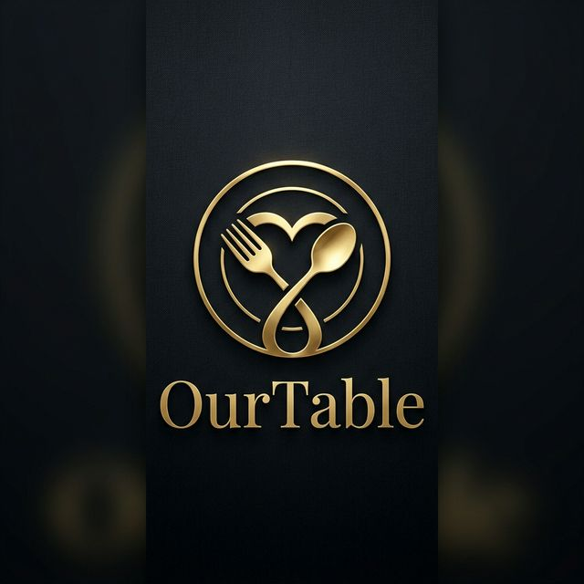

# 🍽️ OurTable



**OurTable** is a beautifully crafted, cross-platform mobile application designed specifically for couples to curate and manage their shared restaurant wishlist. Say goodbye to scattered links, forgotten recommendations, and "where should we eat?" debates. 

Built with **React Native**, **Expo**, and backed by **Supabase**, this app focuses on a premium, highly synchronized experience featuring a bespoke, warm, romantic UI theme. It supports offline-caching, realtime push notifications, cross-platform deep-linking, and native Android Share Sheet integrations.

---

## 🌟 Features

- **Sync as a Couple**: Form a persistent data link with your partner using a secure 6-character Invite Code. Reverting back to single-mode or deleting your account removes you seamlessly.
- **Save Places with Precision**: Pull in Google Maps coordinates naturally, parse Instagram URLs instantly, or search OpenStreetMap with contextual geolocation overrides.
- **Native Android Share Sheet**: Share restaurant links directly from Chrome, Google Maps, or Instagram into OurTable effortlessly without needing to copy/paste.
- **Realtime Push Notifications**: Receive immediate local and remote notifications whenever your partner saves a new spot or leaves a rating.
- **Bespoke Dynamic Themes**: 
  - ☀️ *Light Mode*: Warm cream background, terracotta primary, gold accents — evoking *candlelight on linen*.
  - 🌙 *Dark Mode*: Deep espresso brown background, warm orange primary, gold accents — evoking a *fine dining room at night*.
- **Offline & Performant**: Robust integration with `@react-native-async-storage/async-storage` for highly active localized session and theme caching.

---

## 🎨 Design Principles

OurTable completely rejects the "generic spreadsheet" aesthetic common in list-making apps. It is built strictly on a **Warm Romantic + Dark Elegant** design language to simulate the feeling of planning a beautiful date night:

1. **Emotion Over Utility**: The interface prioritizes warmth and intimacy. Harsh primary colors (like generic blues/reds) are entirely replaced by curated, specialized hex codes.
2. **Candlelight on Linen (Light Mode)**: We completely avoid `#FFFFFF`. Instead, the app uses warm cream backgrounds (`#FFFBF7`) paired with a terracotta orange (`#C9673A`) and deep espresso typography (`#2C1A0E`).
3. **Fine Dining Room (Dark Mode)**: Dark mode refuses to use pure black (`#000000`). It establishes depth through a deep espresso base (`#1A0F0A`), slightly elevated secondary cards (`#26160E`), and 'warm snow' text (`#F5ECD8`) that is exceptionally easy to read in low-light environments.
4. **Fluid Affordances**: Utilizing `react-native-reanimated` to build engaging spring animations (like the multi-state floating action button) so the app feels continuously interactive, tactile, and alive.

---

## 🏗️ Technology Stack

- **Framework**: [React Native](https://reactnative.dev/) via [Expo](https://expo.dev/) (SDK 51+)
- **Routing**: [Expo Router](https://docs.expo.dev/routing/introduction/) (File-based navigation)
- **Database & Auth**: [Supabase](https://supabase.com/) (PostgreSQL, Realtime, RPC, Storage)
- **State Management**: React Hooks (`useState`, `useEffect`, `useCallback`)
- **Animations**: [React Native Reanimated](https://docs.swmansion.com/react-native-reanimated/) (spring-based animations and transitions)
- **Local Storage**: AsyncStorage
- **Deep Linking**: `expo-linking` + custom Android Intent overrides (`expo-intent-launcher`)
- **Native APIs**: 
  - `expo-clipboard`
  - `expo-location`
  - `expo-notifications`

---

## 🚀 Getting Started

### Prerequisites
- Node.js (v18+)
- EAS CLI (installed via `npm install -g eas-cli`)
- A [Supabase](https://supabase.com/) project
- An Android Emulator or physical device (required for Share Intent features)

### 1. Installation

Clone the repository and install the Node dependencies:

```bash
git clone https://github.com/nainu25/OurTable.git
cd our-table
npm install
```

### 2. Environment Setup

Create a `.env` file at the root of your project and populate it with your Supabase credentials:

```env
EXPO_PUBLIC_SUPABASE_URL=your_supabase_url
EXPO_PUBLIC_SUPABASE_ANON_KEY=your_supabase_anon_key
```

### 3. Database Configuration

You need to execute the following relational schemas via your Supabase **SQL Editor**:

1. Initialize standard `profiles`, `couples`, `places`, and `notifications` tables.
2. Enable Row Level Security (RLS) properly to restrict reads/writes between joined couples.
3. Deploy the database-level `delete_user()` RPC trigger to allow destructive profile cleanup locally:

```sql
CREATE OR REPLACE FUNCTION delete_user()
RETURNS void AS $$
BEGIN
  DELETE FROM auth.users WHERE id = auth.uid();
END;
$$ LANGUAGE plpgsql SECURITY DEFINER;
```

### 4. Running Locally

Because OurTable runs custom native code to intercept the **Android Share Intent** and `expo-clipboard` binaries, **it cannot be run within the standard Expo Go client**. You must run a native build:

```bash
# Spin up the local Metro Bundler
npx expo start --clear

# Compile and launch the native Android framework
npx expo run:android
# Or
eas build --profile development --platform android
```

---

## 🧩 Architecture Decisions

- **Config Plugin Injection**: Instead of ejecting from the managed Expo workflow, OurTable utilizes a custom plugin (`plugins/withAndroidShareIntent.js`) that dynamically rewrites `AndroidManifest.xml` and injects Kotlin code directly into `MainActivity.kt` during the prebuild phase!
- **Edge-less Account Deletion**: Instead of routing through finicky serverless Deno edge functions to handle Account Deletion, OurTable offloads it natively to Postgres through a `SECURITY DEFINER` RPC script.
- **Theme Segregation**: Themes are inherently bound via the `@react-navigation/native-stack` component tree to prevent aggressive rendering leakage (like keyboard animation flashes).

---

## 📸 Media Assests

Brand assets like the golden icons and deep espresso splash screens reside entirely within the `/assets/branding` folder, rigorously optimized and compiled through the Expo build lifecycle.

---

> Built with ❤️ for memorable dinners.
